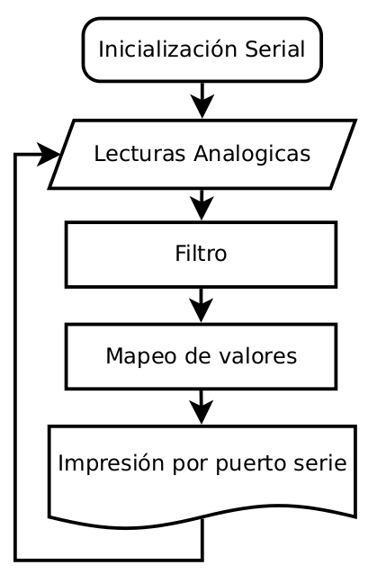
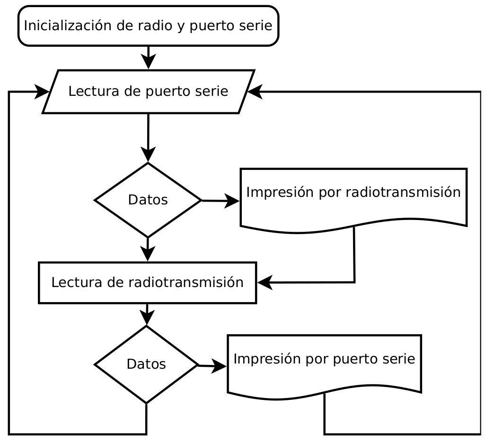
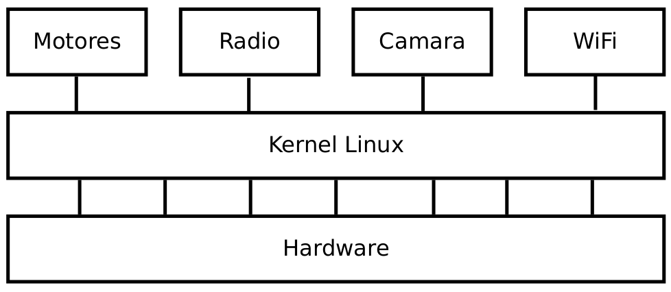
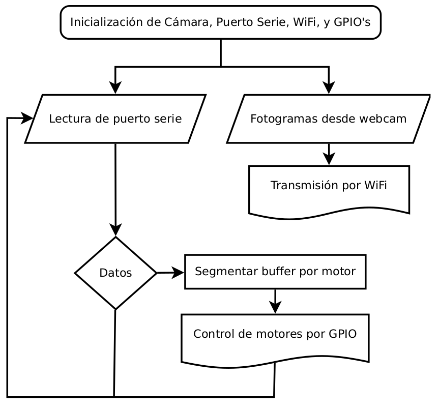

## Sobre Código Fuente

En esta carpeta se encuentran las fuentes en desarrollo y librerias base utilizadas para darle vida a Tolina, en su totalidad son desarrollos en Lenguaje C.

### Diagrama de software del Comando

### Diagrama de software de Comunicación

### Diagrama de software de Carga Útil

