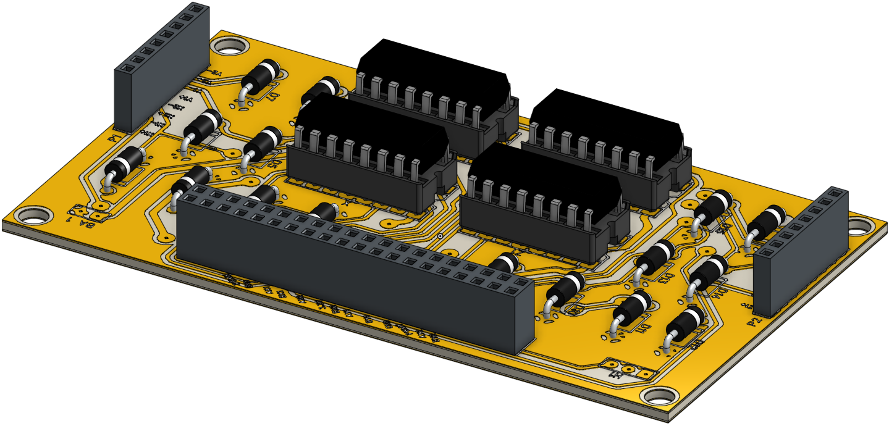
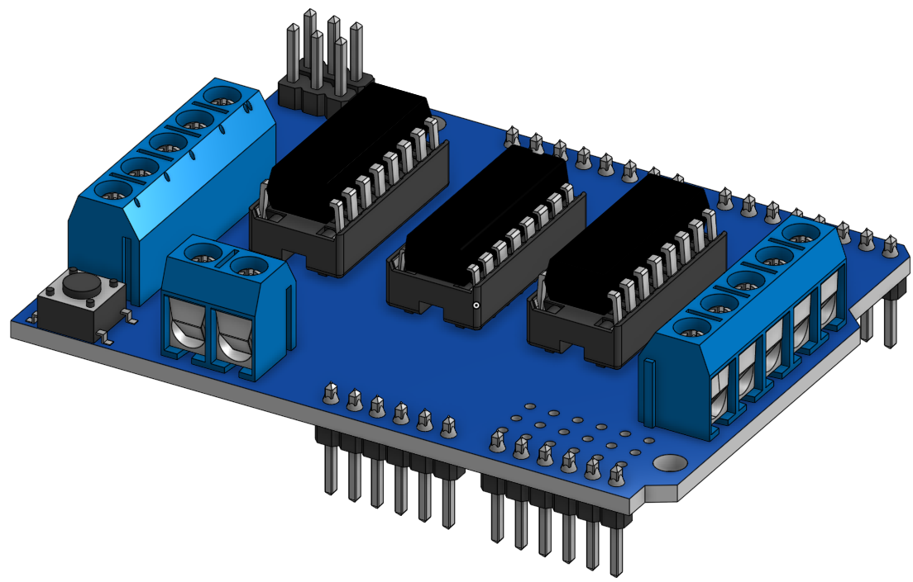
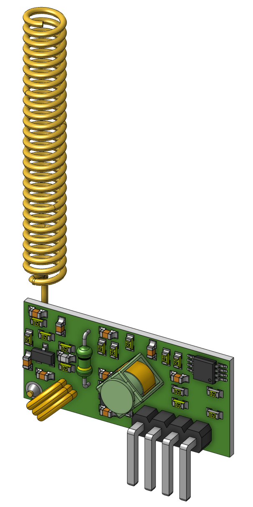
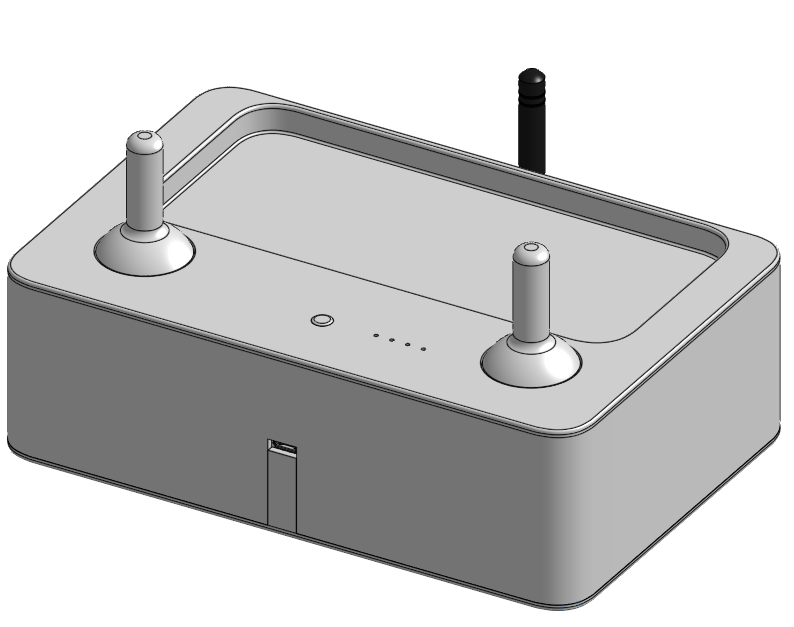

# Modelados 3D

Tanto como para la determinación del centro de masa, como para facilitar aspectos relacionados a la integración realizada a distancia y en forma descentralizada, se realizaron los siguientes modelados 3D:

## PCDuino4 nano

Fabricante: [LinkSprite](https://www.linksprite.com/pcduino4-nano/)
Modelado: [OnShape](https://cad.onshape.com/documents/b4b0b3f34a575819a2707872/w/88d6b2fa41ddc3f8a9d6b3d2/e/b33581a21ca1b7f09e8596de)

## EESAM34R

Fabricante: [Elemon](https://www.elemon.com.ar/Cotizar.aspx)
Modelado: [OnShape](https://cad.onshape.com/documents/ec4b6312847b79863e13bf8e/w/0436242ac0876fc591eb0102/e/217696dc8bc2e912b344ecc6)

## Antena SGSM008-SMA/M-R/A-5

Fabricante: [Elemon](https://www.elemon.com.ar/Cotizar.aspx)
Modelado: [OnShape](https://cad.onshape.com/documents/461af691bdc8e8293b6acc81/w/5bf0a661077147eb908c0616/e/5cb2624135b9eea222923b98)

## ShielDuino-T (Modulo controlador de 8 motores nativo de Tolina)

Fabricante: [Tolina](https://github.com/huguitovi/Tolina)
Modelado: [OnShape](https://cad.onshape.com/documents/e3b788214f8b06f891d40f1e/w/c74bf7b978118f32a32821e2/e/986af21a91f393d954ba1fb5)

## Logitech C200

Fabricante: [Logitech](https://support.logi.com/hc/en-us/articles/360023307014-Logitech-Webcam-C200-Technical-Specifications)
Modelado: [OnShape](https://cad.onshape.com/documents/c44ed40a48549f56abfa6e95/w/bb11458fc9d157a45261392b/e/d3aeba1b3881ed7b99e6e940)

## SRF04

Fabricante: [China]()
Modelado: [OnShape]()

## MPU9250 BMP260

Fabricante: [Bosch]()
Modelado: [OnShape](https://cad.onshape.com/documents/137634499555791615642d57/w/9201c79dbb14d58388e90772/e/1ceaf7b055e3bd4cd616bf7e)

## JSN-SR04T

Fabricante: [JSN](https://www.elemon.com.ar/Cotizar.aspx)
Modelado: [OnShape](https://cad.onshape.com/documents/5689bac8cee0096f19e13d54/w/39e027f5c27cfc006658e57e/e/44e5082090eb61c592169ccd)

## EESAM34R

Fabricante: [I-O Data]()
Modelado: [OnShape](https://cad.onshape.com/documents/2a58d5fc7cfdaa5131b7bced/w/1790b3b75a4a6e0e9be4c743/e/e5ab12a85833402ce6b296c1)

## Arduino nano

Fabricante: [Arduino CC](https://www.arduino.cc/)
Modelado: [OnShape](https://cad.onshape.com/documents/e08e87ede2b085dabb8ec284/w/2d2faaebe3f86c9a17560737/e/5b4681878ee84e214a5b4865)

## Shield Motores Arduino

Fabricante: [Adafruit/LadyAda](https://www.adafruit.com/product/81)
Modelado: [OnShape](https://cad.onshape.com/documents/8d47852de01c4f7387d6f724/w/a000db7d16f8f21633216dc9/e/aa8d04f9ba54ca66b5974670)

## Motor con reductor y helice (Gear Box 820 Coreless Cw Motor + Propeller Combo Set)

Fabricante: [Gear Box 820 Coreless Cw Motor + Propeller Combo Set](https://www.adafruit.com/product/81)
Modelado: [OnShape](https://cad.onshape.com/documents/0da1457debc2a4a932a4e4b8/w/93f8d65b40d40a5ed462e47c/e/6945122e04e86da24dd1f20e)

## Palanca de comando (KY-023 Dual Axis Joystick Module)

Fabricante: [KY-023](https://arduinomodules.info/ky-023-joystick-dual-axis-module/)
Modelado: [OnShape](https://cad.onshape.com/documents/0726fa1b1b917e7525642e5a/w/507874bc5735f5b12601344c/e/7aaea927ce7cc22c705d6ab0)

## RF433 Receptro y transmisor

#### Emisor
Modelado: [OnShape](https://cad.onshape.com/documents/c004816032ad218b156599f2/w/bebf56a0e8003108964e5747/e/70b6ae09fcd66aa26aaf5e35)

#### Receptor
Modelado: [OnShape](https://cad.onshape.com/documents/db5adeeefbcc91026425b5d4/w/9b04f95ce5a829f2a64d8bc5/e/4a731cc7295ea3d0d6fe656e)

## Vistas explotadas de Comando y Carga útil

#### Comando

#### Carga útil

###### PCB de interconexion en Carga útil

<!---just---#

>