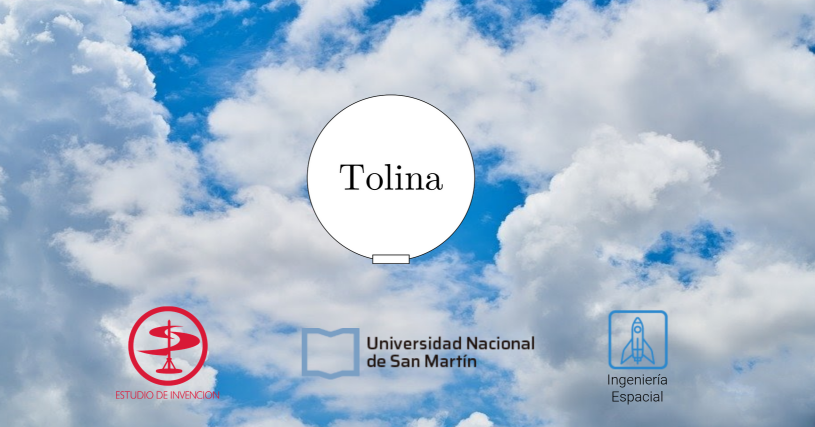
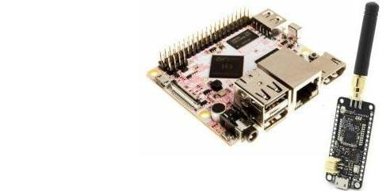

## Sobre Tolina

Tolina es un dirigible esférico, proyecto perteneciente a los estudiantes del segundo cuatrimestre de 2020 de la materia Proyecto Integrador II, de la carrera de [Ingenieria Espacial](http://www.unsam.edu.ar/ingenierias/#ingenierias) perteneciente a
la [Escuela de Ciencia y Tecnología](http://www.unsam.edu.ar/escuelas/ciencia/) de la [UNSAM](https://www.unsam.edu.ar/).

## Ingeniería Espacial
Argentina es uno de los siete países que tienen satélites propios. Los proyectos para aumentar la soberanía espacial demandan ingenieros con esta formación. Podrás diseñar vehículos y dispositivos cuyo ambiente está en el espacio, donde hay vacío, radiaciones electromagnéticas, temperaturas bajo cero y meteoritos. Esta es la primera carrera de América Latina en su tipo y tiene una orientación en sistemas complejos. La creatividad, la inventiva y la innovación son las habilidades esenciales de cualquier ingeniero. La Ingeniería Espacial implementará una nueva pedagogía para concebir, diseñar, implementar y operar sistemas, productos y servicios espaciales. Los alumnos participarán de proyectos integradores y multidisciplinarios dentro de un [Estudio de Invención](http://estudiodeinvencion.com.ar), que contará con un laboratorio de prototipado rápido y amplios espacios de trabajo con todas las herramientas y técnicas digitales modernas.

## Audiencia. ¿Para quién está pensado?
Tolina es realizado en medio de una crisis de salud mundial generada por la Pandemia de COVI-19, de tal forma es pensado como un medio para permitir a sus usarios una forma alternativa, de largo alcance de radiofrecuencia, larga vida de las baterias, para gestionar la logistica prioritaria de las vacunas a sectores de dificil acceso, tanto como de distintas mercancias, salvaguardando la salud y manteniendo la distncia social, recomendada por la [OMS](https://www.aaoms.org/practice-resources/covid-19-updates).

## Contenido
El objetivo de este repositorio es permitir al equipo trabajar desde sus casas, mantener al día los cambios de versión, abrir el trabajo a la comunidad y de esta forma gestionar más eficientemente el tiempo de desarrollo y ensayos de los distintos subsistemas.

## Requerimientos
Para utilizar estos códigos es necesario tener un PCDuino4 nano, el kit de desarrollo LoRaWAN ofrecido por Elemon SAMR34, clon de [Penguino Feather SAMR34](https://makertronika.com/penguino-samr34/) y demas componentes detallados en el [BOM](https://docs.google.com/spreadsheets/d/1q8VCjkfIKXkzYkmn2R5FzP_4t8kTszAMtYl-jQM-gV4/edit?usp=sharing). Los requermientos de sistema se detallan [aquí](https://github.com/huguitovi/Tolina/blob/master/documentos/Requerimientos.md).

## Dedicación y duración
Este proyecto dura un cuatrimestre y es de dedicación completa por parte del equipo de estudiantes que en este tiempo deben tener listo y operativo el dirigible.
